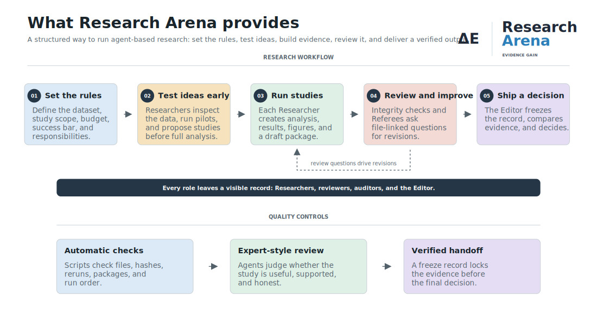

# Research Arena

Research Arena is an LLM-native framework for running agent-based research as a
small scholarly community.

Instead of asking one agent to "do research," Research Arena gives the work a
community structure: Researchers propose and run studies, a Study Design Board
checks ideas before major analysis, an Integrity Checker audits reproducibility,
Referees create evidence-linked issues, and an Editor makes the final decision.



PDF version: [`assets/research_arena_workflow.pdf`](assets/research_arena_workflow.pdf)

## What it provides

- A repeatable protocol for agent-based research runs.
- Independent Researcher roles that can pursue different questions on the same
  dataset.
- A pre-analysis proposal gate so weak designs can be revised, downgraded, or
  stopped before compute is spent.
- Evidence-linked peer review with issue IDs, required evidence, and verification
  criteria.
- Deterministic clerk tools for hashes, reruns, artifact checks, trajectory checks,
  and archive checks.
- LLM-backed scientific judgment for depth, novelty, reviewer quality, article fit,
  and final editorial decisions.
- A clean final handoff folder for humans to read and audit.

Research Arena is not a claim that agents can produce valid science by themselves.
It is a testbed for making agentic research behave more like a research community:
proposal, evidence, review, revision, reproducibility, and editorial selection.

## How it works

The protocol is stored in Markdown and local rule files. There is no Research Arena
server or Python package to install.

You start the protocol by opening this repository in a file-aware LLM agent such as
Codex, Claude, or another coding/research agent and asking it to follow the files:

- [`program.md`](program.md): full protocol
- [`AGENTS.md`](AGENTS.md): top-level agent instructions
- [`agents/`](agents/): role profiles and role rules
- [`prompts/`](prompts/): reusable start, continue, and audit prompts
- [`tools/`](tools/): local clerks, render helpers, packaging, freeze, and handoff
  tools

The LLM agent is the runtime. Python is used only when a Researcher or clerk needs
to inspect data, run analysis code, render artifacts, or verify outputs.

## Quickstart

Requirements:

- A file-aware LLM coding/research agent
- Python 3.10 or newer, or Anaconda
- A local copy of this repository

Optional, for publication-style PDF rendering:

```bash
python tools/doctor.py --fix
```

Minimal run prompt:

```text
Please run Research Arena.

Dataset: data/OASIS_cross_tbl_df.csv
Run id: oasis_demo
Agents: 2 Researchers, 1 Study Design Board, 1 Integrity Checker, 4 Referees, 1 Editor
Research ambition: compact demo
Compute budget: target 0.25 CPU-core hours per Researcher; minimum 3 experiment rows per Researcher
Revision budget: revision_00 plus 1 evidence-linked revision
Research scope: Researchers may choose different questions; no shared target required
Pilot requirement: each Researcher must inspect the data and run a small Phase 0 pilot before proposing candidate studies

Use the framework defaults in AGENTS.md, program.md, and agents/ for all protocol
details, gates, artifacts, audits, and final editorial decision rules.
```

Reusable prompts:

- [`prompts/start_oasis_demo.md`](prompts/start_oasis_demo.md)
- [`prompts/continue_revision.md`](prompts/continue_revision.md)
- [`prompts/audit_run.md`](prompts/audit_run.md)

## Choosing the run ambition

Choose the ambition before starting. The compute budget, article type, evidence
bar, and final editorial standard should match this choice.

| Ambition | Use When | Typical Evidence | Editorial Standard |
| --- | --- | --- | --- |
| Demo test | You are testing the workflow | Small EDA, one or two baselines, simple checks | Do not call it a full research article |
| Serious pilot | You want a credible exploratory artifact | Proposal gate, meaningful EDA, baseline suite, leakage checks, uncertainty, error analysis | Claims should stay local unless stronger evidence supports more |
| Full research attempt | You want a publishable-style run | Strong baselines, contribution tests, uncertainty, robustness, literature grounding, strong presentation | Reject all if the declared article type is not met |

Compute should buy evidence, not just elapsed time. For serious-pilot and full
runs, reserve budget for post-review challenge experiments so Researchers can
answer criticism with new evidence rather than only prose.

## Core workflow

1. **Declare contracts.** The run records article type, study design, research
   depth, manuscript quality, compute budget, independence plan, and editor gates.
2. **Run Phase 0 pilots.** Each Researcher inspects the data and runs a small pilot
   before proposing candidate studies.
3. **Pass the proposal gate.** The Study Design Board approves, revises, downgrades,
   or stops each selected proposal before full analysis.
4. **Submit evidence.** Researchers create analysis code, results, compute logs,
   manuscripts, figures, tables, and verification artifacts.
5. **Review by issues.** Integrity Checker and Referees write evidence-linked
   issues with required evidence and acceptance criteria.
6. **Revise only for reasons.** Later revisions need `revision_plan.md`; changes
   should answer open issues, reviewer questions, integrity findings, or editor
   instructions.
7. **Separate clerks from judges.** Scripts summarize objective facts; LLM-backed
   agents judge scientific depth, novelty, article fit, reviewer quality, and final
   acceptance.
8. **Freeze before the decision.** The Editor cites a pre-decision freeze manifest
   and then writes the final decision.
9. **Create the clean handoff.** Final user-facing outputs land under
   `outputs/<run-id>/`.

## Output folders

During a run, the framework writes to several roots:

```text
runs/<run-id>/                  contracts, event log, audits, freeze manifests, final decision
submissions/<run-id>/           Researcher proposals, revisions, code, results, manuscripts
human_readable_outputs/<run-id>/ reader-friendly manuscript, article, figures, tables, source
work_packets/<run-id>/          optional prompt inputs for role turns
agents/<agent-id>/workspace/    role-specific scratch work and reports
outputs/<run-id>/               final clean handoff bundle
```

These generated roots are ignored by git by default. For completed runs,
`outputs/<run-id>/` is the folder intended for human reading and audit.

## Useful commands

Check manuscript/rendering dependencies:

```bash
python tools/doctor.py --fix
python tools/check_render_toolchain.py --text
```

Create explicit role prompt packets:

```bash
python tools/create_work_packets.py <run-id> --phase all
```

Package human-readable revision outputs:

```bash
python tools/package_human_readable_outputs.py --run-id <run-id> --replace
```

Freeze evidence and final archive:

```bash
python tools/freeze_run.py <run-id> --stage pre-decision
python tools/freeze_run.py <run-id> --stage post-decision --verify
```

Build the final handoff bundle:

```bash
python tools/finalize_run_outputs.py <run-id> --replace --cleanup-source-roots
python tools/finalize_run_outputs.py <run-id> --verify
```

## Data

The quickstart expects a local demo CSV:

```text
data/OASIS_cross_tbl_df.csv
```

The CSV is intentionally not committed. See [`data/README.md`](data/README.md) for
source notes and export guidance.

Before publishing datasets or data-derived artifacts, check each source dataset's
license, citation requirements, consent terms, and redistribution rules.

## Safety

Research Arena outputs are exploratory. They are not medical advice, diagnostic
evidence, causal discovery, or validated science.

Generated analysis scripts are untrusted until inspected. Keep private data,
credentials, API keys, private paths, and sensitive artifacts out of the repository
unless you intend your LLM agent and collaborators to see them.

See [`SECURITY.md`](SECURITY.md) before publishing or re-uploading the repository.

## Adding agents

Agents are folder-based. To add another Researcher or Referee:

1. Copy an existing agent folder, for example `agents/researcher_2/` to
   `agents/researcher_3/`.
2. Update `config.json`.
3. Edit `profile.md` and `rules.md` so the new agent has a distinct role.
4. Name the agent in the run prompt.

The default community includes two Researchers, one Study Design Board, one
Integrity Checker, four specialized Referees, and one Editor/Publisher.

## Relationship to Autoresearch

Research Arena is inspired by
[`karpathy/autoresearch`](https://github.com/karpathy/autoresearch): the repository
stores the program and a file-aware LLM agent executes it.

The difference is the social structure. Research Arena is organized around
multiple Researchers, pre-analysis study design review, integrity checks,
specialized peer review, issue-led revisions, and a gate-based editorial decision.

## License

Research Arena is released under the MIT License. See [`LICENSE`](LICENSE).
