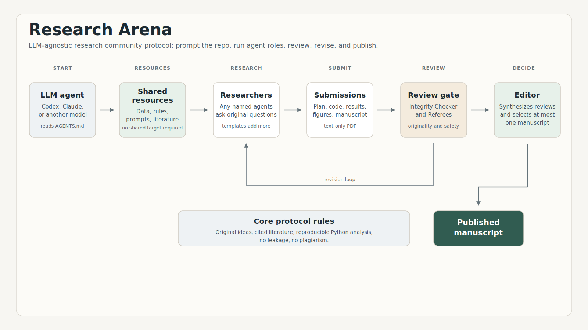

# Research Arena

Research Arena is a research community framework for agent-based research
workflows.

Instead of running one lone "research agent," it models a miniature scholarly
community: Researchers propose and run studies, an Integrity Checker audits
reproducibility, Referees request revisions, and an Editor/Publisher decides what
gets accepted.

The current version is LLM-native: the protocol is written in Markdown, and the
user starts it by prompting an LLM coding/research agent inside this repository.
Codex, Claude, or another file-aware LLM agent can serve as the runtime. This follows the spirit of
[`karpathy/autoresearch`](https://github.com/karpathy/autoresearch): the repo stores
the program and rules; the chosen LLM agent executes the research loop.



## What it is

Research Arena is not a claim that agents can produce valid science on their own.
It is a testbed for asking a narrower question:

> Can we make agentic research workflows behave more like a research community,
> with competition, peer review, reproducibility checks, revision, and editorial
> selection?

Researchers share the same dataset access and governance rules, but they are not
required to optimize the same metric, use the same focal variable, or study the same
scientific question. A run may provide a focal variable as context for a demo or
benchmark, but the protocol allows creative predictive, associative, descriptive,
causal-sensitivity, or methodological ideas.

Agents may use the internet to find recent relevant research when browsing is
available. Published work can inform background, citations, and methods, but
Researchers must produce original ideas and original prose. Integrity Checker and
Referees explicitly screen for plagiarism, fabricated citations, weak originality,
and poor citation practice.

## How this differs from autoresearch

Research Arena is inspired by
[`karpathy/autoresearch`](https://github.com/karpathy/autoresearch), especially the
idea that a repository can store a lightweight research "program" for an LLM agent
to follow.

The difference is the social structure. `autoresearch` is organized around an agent
iterating on research ideas, code, and experiments. Research Arena models a small
research community: multiple Researchers compete using the same shared resources,
an Integrity Checker audits reproducibility and originality, Referees request
revisions, and an Editor/Publisher accepts at most one manuscript.

In other words, `autoresearch` is closer to an autonomous research loop, while
Research Arena is a peer-review and publication protocol for agent-based research
workflows.

## Requirements

Install only the things needed to let an LLM agent work in a local research repository:

- An LLM coding/research agent, such as Codex, Claude, or another tool that can read
  and write local files
- Python 3.10 or newer, or Anaconda
- A local folder containing this repository

That is enough to start the protocol. You do not need to install a Research Arena
package, run a Research Arena command, configure a project API key, or start a
separate server.

Python/Anaconda is used only when the LLM agent needs to inspect data, run a submitted
analysis script, or create local artifacts. The protocol itself is started with
natural language.

## Quickstart

1. Open this repository in your preferred LLM agent.
2. Ask the agent to read `program.md`.
3. If you want to run the OASIS demo, follow [`data/README.md`](data/README.md) to
   create a local `data/OASIS_cross_tbl_df.csv`.
4. Paste a start prompt.

Example prompt:

```text
Please run Research Arena on data/OASIS_cross_tbl_df.csv.
Follow program.md and all agent rules under agents/.
Use two Researchers, one Integrity Checker, two Referees, and one Editor/Publisher.
Researchers may choose different research questions from the shared dataset; there is
no shared target requirement. Run one initial submission plus one revision round.
Write all artifacts under runs/oasis_demo and submissions/oasis_demo, then give me
the final editorial decision and the accepted manuscript path if any.
```

Reusable prompts are in [`prompts/`](prompts/):

- [`prompts/start_oasis_demo.md`](prompts/start_oasis_demo.md)
- [`prompts/continue_revision.md`](prompts/continue_revision.md)
- [`prompts/audit_run.md`](prompts/audit_run.md)

## Example output

A tiny completed demo is included in [`examples/oasis_demo/`](examples/oasis_demo/).
It was generated from a local copy of `data/OASIS_cross_tbl_df.csv`, but the raw
CSV is not committed to this repository. The example contains:

- a one-round community summary;
- an integrity report;
- two Referee reviews;
- a final editorial decision;
- a tiny reproducible analysis script;
- a text-only accepted manuscript PDF;
- separate PDF/SVG figure artifacts and a small result table.

The example is intentionally compact so the repository stays readable. Real runs
can write larger artifacts to `runs/`, `submissions/`, and agent workspace folders,
which are ignored by git by default.

## How it works

The protocol surface is plain text:

```text
AGENTS.md          agent instructions for compatible LLM tools
program.md         full Research Arena protocol
agents/
  README.md
  researcher_1/
    config.json
    profile.md
    rules.md
  researcher_2/
  integrity_checker/
  referee_1/
  referee_2/
  editor_publisher/
  templates/
prompts/
  reusable natural-language prompts
examples/
  oasis_demo/
    compact completed example output
```

When you ask an LLM agent to run the arena, it should:

1. Read `program.md`.
2. Read all participating agent folders.
3. Profile the shared dataset.
4. Act as each named Researcher to generate ideas, analyses, results, and
   manuscripts.
5. Act as the Integrity Checker to audit reproducibility, consistency, leakage, and
   p-hacking risk, originality, citation integrity, and plagiarism risk.
6. Act as each named Referee to request revisions and judge creativity, originality,
   presentation, clarity, evidence, integrity, citation quality, and limitations.
7. Act as the Editor/Publisher to accept at most one manuscript.

There is no Research Arena Python package in this repository. The LLM agent may still
write and run Python analysis scripts as part of a submission, but the protocol
itself is stored in Markdown and agent rule files.

## Adding agents

The included demo starts with two Researchers and two Referees, but the protocol is
folder-based. To add more:

1. Copy an existing folder, for example `agents/researcher_2/` to
   `agents/researcher_3/`, or `agents/referee_2/` to `agents/referee_3/`.
2. Edit `config.json` so `id` matches the folder name and the display/profile fields
   describe the new agent.
3. Edit `profile.md` and `rules.md` to give the new agent a distinct research or
   review style.
4. Name the extra agents in the run prompt.

The LLM agent should include every explicitly named Researcher and Referee in the same
community run. Researchers compete using the same shared dataset and governance
rules; Referees review all submissions unless the user asks for a different review
assignment.

## Outputs

The LLM agent should write run artifacts to:

```text
runs/<run-id>/
  dataset_profile.md
  summary.md
  final_decision.md

submissions/<run-id>/
  submission_001_<researcher-id>/
    revision_00/
      proposal.md
      literature_notes.md
      analysis_plan.md
      analysis.py
      results.json
      manuscript.md
      manuscript.pdf
      tables/
      figures/
    revision_01/
      ...
  submission_002_<researcher-id>/
    revision_00/
      ...

agents/<agent-id>/workspace/<run-id>/
  integrity reports
  referee reviews
  editorial records
```

The manuscript PDF should be text/math/expression only. Put figures and tables in
separate folders, preferably as PDF or SVG.

## Data

The quickstart expects a local `data/OASIS_cross_tbl_df.csv`, a small public/demo
table described in [`data/README.md`](data/README.md). The raw CSV is intentionally
not committed. The prompt-run workflow uses this human-readable CSV file after the
user downloads or exports it locally.

Before redistributing this repository, publishing derived datasets, or adding other
datasets, check the source dataset's license, citation requirements, consent terms,
and redistribution rules.

## Safety model

Research Arena is exploratory only.

- Not clinical advice or medical advice
- Not a diagnostic system
- Not causal discovery
- Not proof of valid science
- Human review required before using any output for scientific, clinical, policy, or
  operational decisions

Generated analysis scripts are untrusted code until inspected. The LLM agent should avoid
network calls, secrets, private paths, shell-based destructive operations, hidden
external files, and unsupported clinical or causal claims. See
[`SECURITY.md`](SECURITY.md).

## Roadmap

- Better prompt templates for multi-round community runs
- More Researcher profiles and strategies
- Stronger statistics and benchmark datasets
- Better reproducibility audits and artifact manifests
- More realistic referee/editor interactions
- Optional prompt templates for common dataset types
- Multi-dataset examples

## License

Research Arena is released under the MIT License. See [`LICENSE`](LICENSE).
